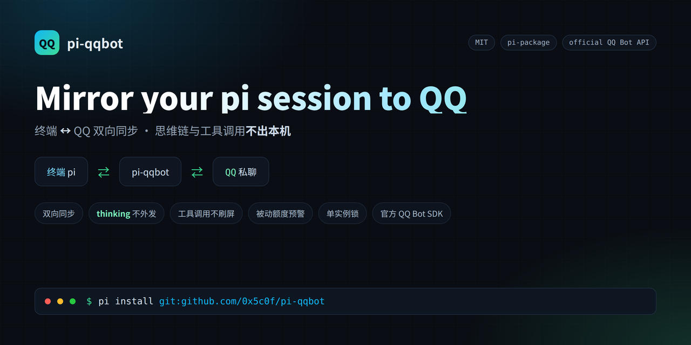

# pi-qqbot

<p align="center">
  
</p>

[English](./README.en.md) | **简体中文**

把**正在运行的 [pi](https://pi.dev) 会话**镜像到一个 QQ 私聊：终端与 QQ 双向同步。

> Mirror a live pi coding-agent session to a QQ private chat, using the official
> QQ Bot API. Terminal and QQ stay in sync; reasoning (`thinking`) and tool calls
> never leak to QQ.

传输层使用腾讯官方 SDK [`@tencent-connect/qqbot-nodejs`](https://www.npmjs.com/package/@tencent-connect/qqbot-nodejs)（MIT）。本扩展只是一层薄胶水，不依赖任何第三方插件。

## 特性

- **双向同步**：QQ 发消息 → 注入当前 pi 会话；pi 的回复 → 回到 QQ。
- **终端也同步**：你在终端里输入的内容会镜像到 QQ。
- **不泄漏思维链**：只发 assistant 的可见文本，`thinking` 永不外发。
- **不刷屏**：工具调用默认不显示到 QQ。
- **抗超长**：去抖合并 + 按 QQ 上限分片。
- **额度感知**：接近/用尽 QQ 被动回复额度时在终端预警。
- **单实例锁**：同一时刻只有一个 pi 连着 QQ。
- **默认手动连接**：`autoConnect: false`，不随手抢占机器人。

## 前置要求

- 已安装 [pi](https://pi.dev)（Node 版本跟随 pi）。
- 一个 QQ 机器人（QQ 开放平台），开通 **单聊 / C2C** 消息权限，取得 `AppID` 与 `AppSecret`。

## 安装

用 pi 的包管理安装（推荐）：

```bash
pi install git:github.com/0x5c0f/pi-qqbot
```

固定版本：

```bash
pi install git:github.com/0x5c0f/pi-qqbot@v0.1.0
```

若已发布到 npm：

```bash
pi install npm:@0x5c0f/pi-qqbot
```

项目内安装（`.pi/`）加 `-l`：

```bash
pi install -l git:github.com/0x5c0f/pi-qqbot
```

安装后请**完全退出并重启 pi**（扩展在启动时加载）。

## 快速开始

1. 重启 pi 后，在终端执行 `/qq-setup`
   填写 AppID、AppSecret、是否有 Markdown 权限 → 保存并连接（**不含绑定**）。
2. 执行 `/qq-bind` 进入绑定模式。
3. 用你的 QQ 私聊机器人发**任意一条消息**。
4. 终端弹出确认框，显示检测到的 openid；确认后写入白名单。

之后终端与 QQ 双向同步即可。只有白名单里的 openid 能驱动会话。

## 命令

| 命令 | 作用 |
| --- | --- |
| `/qq-setup` | 交互式配置：填 AppID/AppSecret 并保存、连接（**不含绑定**） |
| `/qq-bind` | 进入绑定模式：把下一条 QQ 私聊的 openid 写入白名单（换 QQ 号 / 白名单丢失时用） |
| `/qq-connect` | 连接 QQ 网关（抢单实例锁） |
| `/qq-disconnect` | 断开 QQ 网关并释放锁 |
| `/qq-status` | 查看连接、`autoConnect`、锁持有者、目标会话、被动回复余量、日志路径、最近错误 |

切换终端：在旧实例 `/qq-disconnect`，再到新实例 `/qq-connect`。

## 配置

配置文件由 `/qq-setup` 生成，默认路径 `~/.pi/agent/pi-qqbot.json`（权限 `0600`）：

```json
{
  "appId": "YOUR_QQBOT_APP_ID",
  "appSecret": "YOUR_QQBOT_APP_SECRET",
  "markdownSupport": false,
  "allowFrom": [],
  "debounceMs": 1200,
  "maxChunkChars": 4500,
  "forwardTerminal": true,
  "showToolTrace": false,
  "allowGroup": false,
  "autoConnect": false
}
```

| 字段 | 默认 | 说明 |
| --- | --- | --- |
| `appId` / `appSecret` | 必填 | QQ 开放平台机器人凭据 |
| `markdownSupport` | `false` | 机器人是否已通过 QQ Markdown 权限审核；未审核务必保持 `false` |
| `allowFrom` | `[]` | 允许驱动本会话的 QQ openid 白名单；空 = 只能绑定，不能使用 |
| `debounceMs` | `1200` | 助手输出的合并窗口（毫秒），窗口内多条消息合并为一次 QQ 发送 |
| `maxChunkChars` | `4500` | 单条 QQ 文本上限（平台约 5000，留余量） |
| `forwardTerminal` | `true` | 把终端输入镜像到 QQ |
| `showToolTrace` | `false` | 是否在下一条消息前附上工具名 |
| `allowGroup` | `false` | 是否接受群聊 @（默认关闭） |
| `autoConnect` | `false` | 是否在 pi 启动时自动连接。`false` = 需手动 `/qq-connect` |

环境变量覆盖：`PI_QQBOT_CONFIG`、`PI_QQBOT_LOG`、`PI_QQBOT_STATE`、`PI_QQBOT_LOCK`。

## 行为与取舍

同步是三个方向：

```
① QQ → pi      注入当前会话（消息带 [QQ] 标记，用于防止回声）
② pi → QQ      assistant 的 text 块回传
③ 终端 → QQ     终端输入镜像（前缀 🖥 终端）
```

- **思维链不外发**：只取 assistant 内容里的 `text` 块，`thinking` / `toolCall` 天然被排除。
- **工具调用不显示**：`showToolTrace` 默认关闭；工具执行期间仅用 QQ「输入中」提示（不发消息）。
- **去抖合并 + 分片**：避免通知轰炸与超长失败。
- **被动回复额度**：QQ 单聊每条入站消息最多被动回复 **4 次 / 60 分钟**（群聊 5 次 / 5 分钟）。用尽后自动降级为主动消息（受额度限制，可能被拦截）。额度剩 1 次或用尽时会在终端提示，提醒你在 QQ 发一条消息刷新。
- **单实例锁**：连接前抢 `~/.pi/agent/pi-qqbot.lock`；另一存活的 pi 持有时会拒绝连接并提示 PID；持锁进程崩溃后锁自动回收。
- **会话切换不迁移历史**：扩展只持久化「回复目标」（`scope` / `targetId` / `msgId`），**不保存任何聊天内容**。因此换一个 pi 会话连接 QQ 时，QQ 的历史记录**不会**注入新会话，上下文保持干净。想延续上下文请用 pi 自己的 `/resume`。

## 日志

`~/.pi/agent/logs/pi-qqbot.log`（权限 `0600`；超过 2MB 自动截断）。路径可用 `/qq-status` 查看。

## 安全

- **只绑定你自己的 QQ 号**。本扩展把本机 coding agent 暴露成一个 QQ 远程入口，这一点等同于远程执行权限。
- 未绑定（`allowFrom` 为空）时，收到的 QQ 消息会被忽略。
- 配置文件、状态文件、日志均为 `0600`，且不会提交到 git。

## 开发与测试

```bash
git clone https://github.com/0x5c0f/pi-qqbot
cd pi-qqbot
npm install
npm test
```

测试完全离线，**不需要真实 QQ 凭据**：

- `test/core.test.ts`、`test/state.test.ts`、`test/lock.test.ts` — 单元测试：文本抽取（排除 thinking）、分片、被动预算、去抖、注入标记、状态持久化、单实例锁。
- `test/load-harness.mjs` — 用 jiti 加载扩展，校验事件/命令注册与占位配置安全失败。
- `test/flow-harness.mjs` — 假 QQ 传输跑端到端场景（白名单、去重、回声防护、thinking 过滤、去抖、终端镜像、预算降级与预警）。
- `test/bind-harness.mjs` — 绑定流程与目标持久化。
- `test/setup-harness.mjs` — `/qq-setup` 与 `/qq-bind` 的职责分离。

> 单元测试使用 Node 原生 TypeScript 运行，需要 **Node >= 22.18**；harness 通过 devDependency `jiti` 加载扩展。

## 目录结构

```
index.ts               pi 扩展入口：生命周期 / 事件 / 命令
core.ts                纯逻辑：文本抽取、分片、被动预算、去抖、注入标记
config.ts              配置加载、校验、保存（0600）
state.ts               回复目标持久化（跨会话）
lock.ts                单实例锁
log.ts                 文件日志
pi-qqbot.example.json  配置示例
test/                  单元测试 + 离线 harness
```

## 边界

- 只支持 **单聊 C2C + 单 owner**；群聊需要 mention 判定与多会话隔离，`allowGroup` 默认关闭。
- 只做文本镜像，不发送本地文件/图片。
- 不做流式打字机（采用「去抖合并」；官方 `stream_messages` 仅 C2C，可作为后续增强）。

## License

[MIT](./LICENSE)
